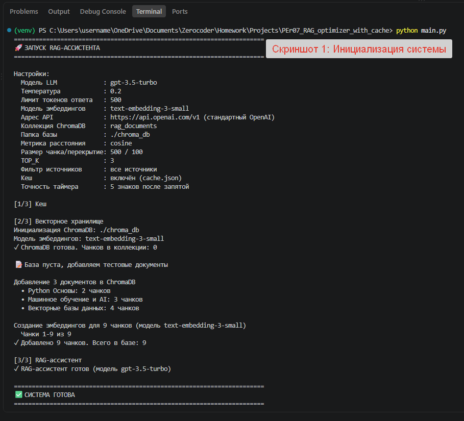
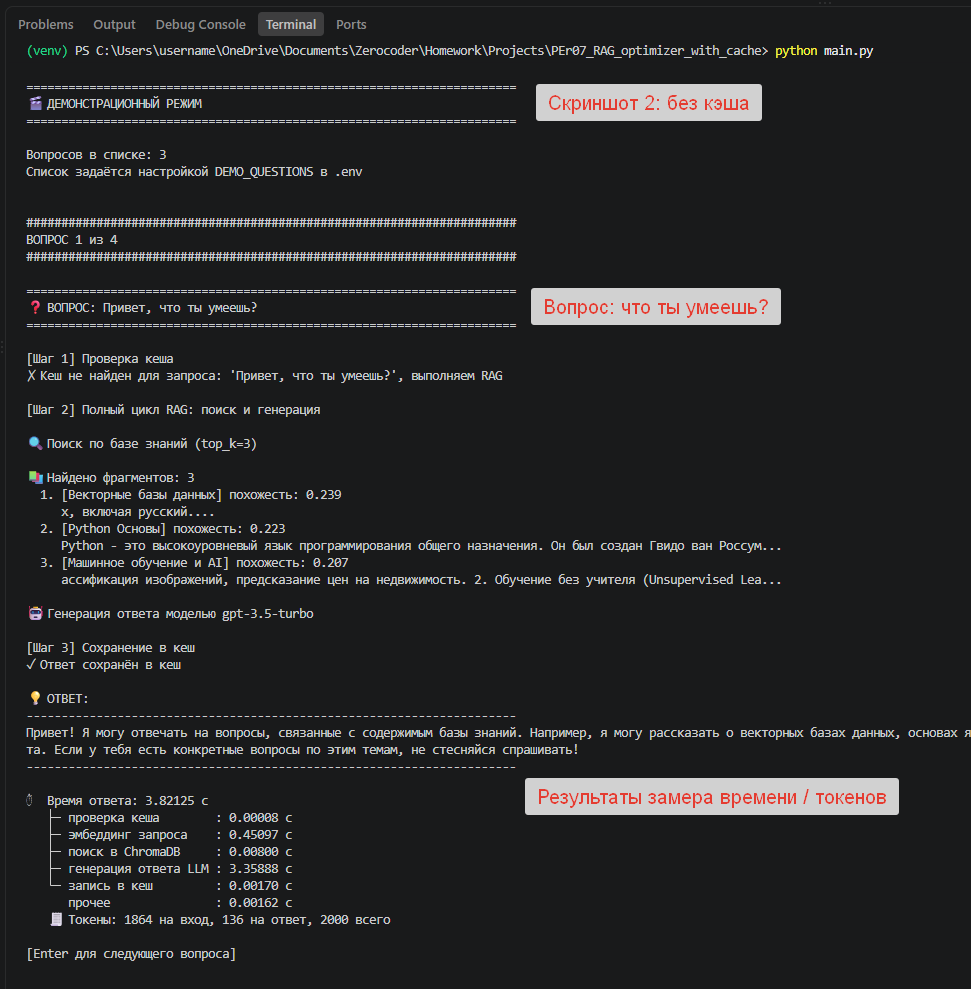
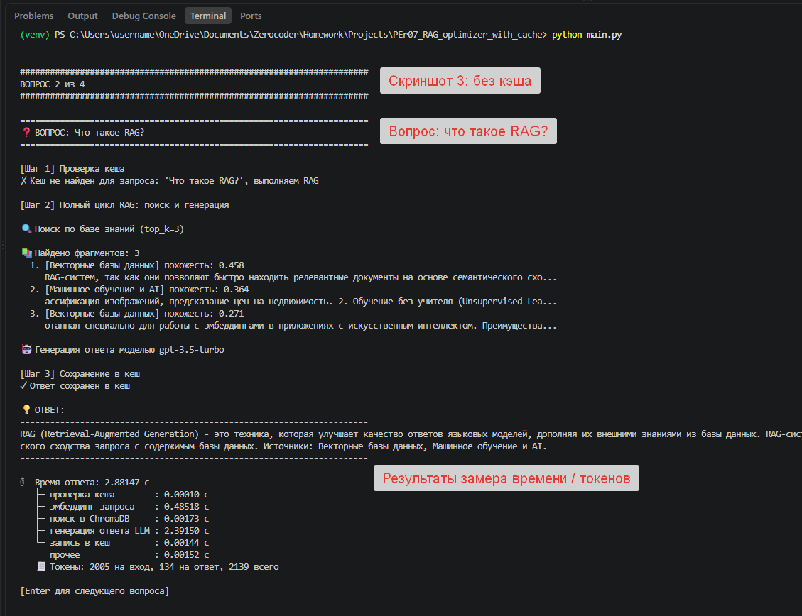
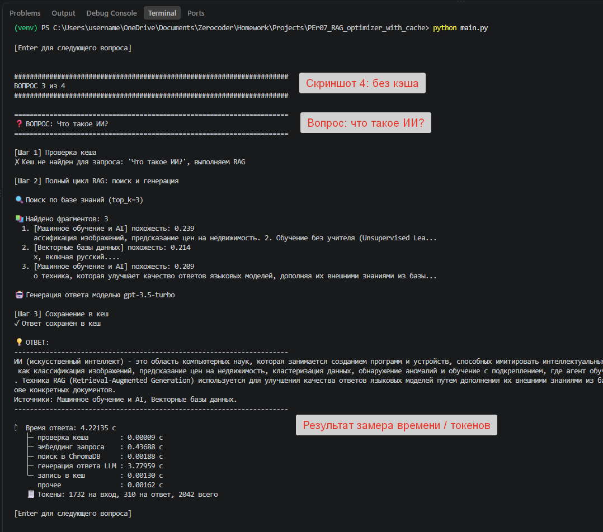
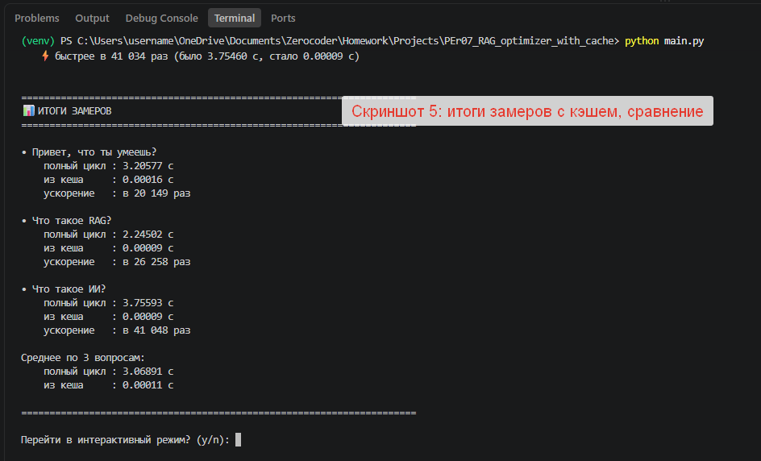
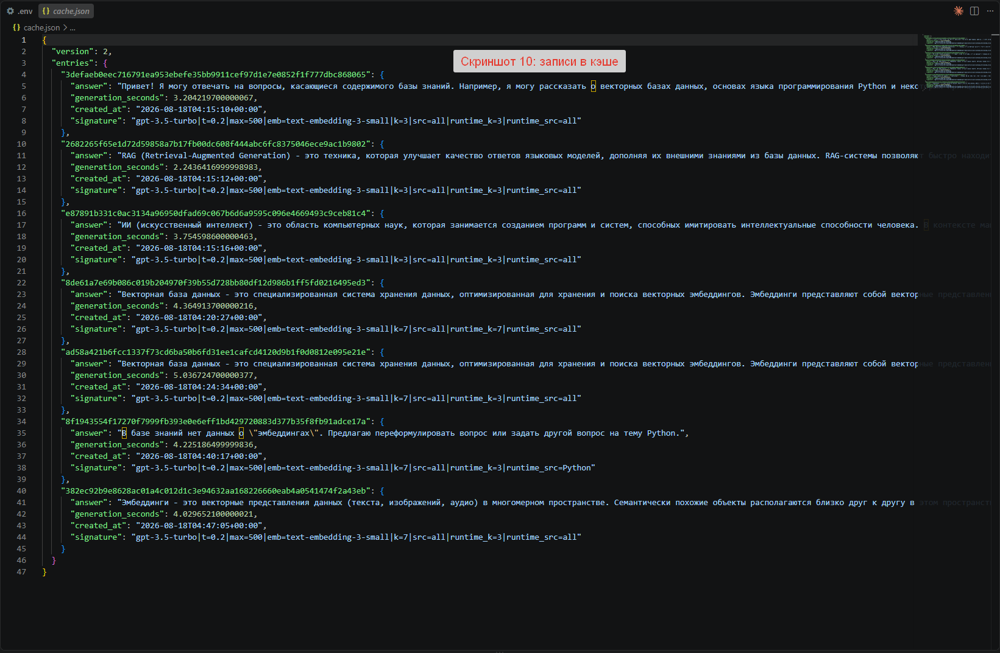
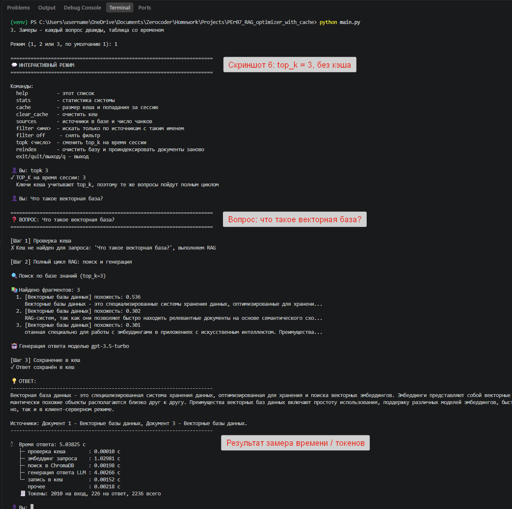
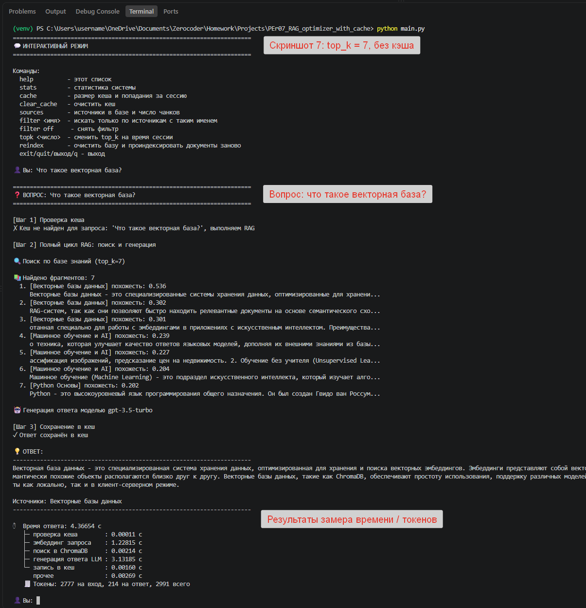
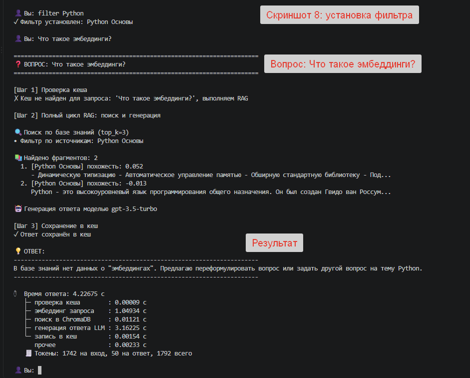
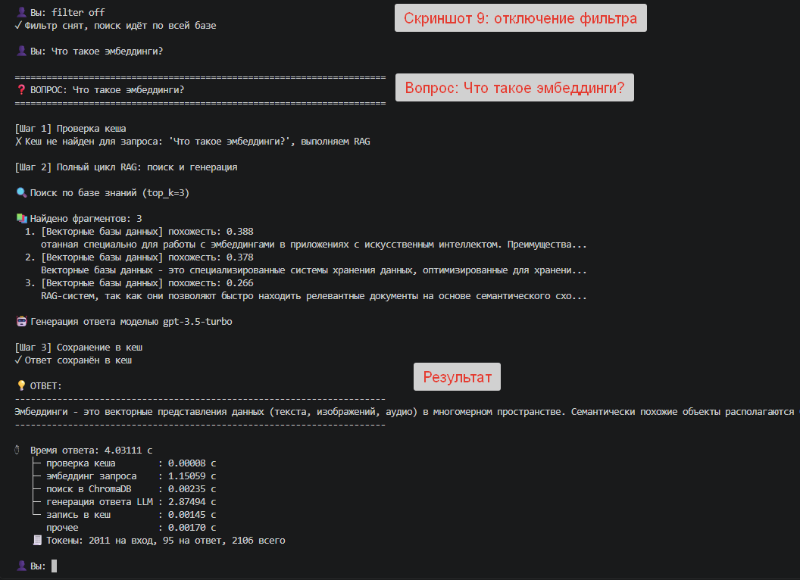

# PEr07. Оптимизация и масштабирование RAG

Домашнее задание. Проект урока (`5-7.zip`) доработан: настройки вынесены в
конфигурацию, добавлен замер времени ответа, системный промпт переписан.

Архив с проектом: `PEr07_rag_optimized.zip`

Все цифры ниже получены на реальных прогонах 18 августа 2026 года. Настройки
прогона: модель `gpt-3.5-turbo`, температура 0.2, лимит ответа 500 токенов,
эмбеддинги `text-embedding-3-small`, метрика cosine, чанк 500 символов с
перекрытием 100.

---

## Этап 1. Подготовка проекта

```bash
python -m venv venv
.\venv\Scripts\activate
pip install -r requirements.txt
copy env.example .env
```

В `.env` вписан `OPENAI_API_KEY`, обращение идёт напрямую в OpenAI, строка
`OPENAI_BASE_URL` оставлена закомментированной.

Отдельно про эту строку, потому что на ней проект сначала падал. Значение вида
`OPENAI_BASE_URL=` не означает "адрес по умолчанию". Библиотека `openai` читает
эту переменную окружения самостоятельно и пустую строку принимает за заданный
адрес, после чего собирает запрос без протокола и падает:

```
httpx.UnsupportedProtocol: Request URL is missing an 'http://' or 'https://' protocol
openai.APIConnectionError: Connection error.
```

Исправлено двумя изменениями. Первое: адрес API всегда передаётся в клиент явно
из `config.py`, а не оставляется на усмотрение библиотеки. Второе: проверка
настроек при запуске отклоняет значение, не начинающееся с `http://` или
`https://`. Проверка на этот случай добавлена в диагностический скрипт.

При первом запуске папки `chroma_db` нет, поэтому база индексируется заново:

| Документ | Чанков |
|---|---|
| Python Основы | 2 |
| Машинное обучение и AI | 3 |
| Векторные базы данных | 4 |
| **Всего** | **9** |

>  Инициализация системы: настройки,
> создание коллекции, индексация 9 чанков.

---

## Этап 2. Базовый запуск и замер времени первых ответов

Заданы три вопроса из задания в демонстрационном режиме. Время не засекалось
вручную: программа печатает его сама после каждого ответа с точностью до
0.00001 секунды и разбивкой по этапам.

### Таблица замеров: первый ответ

| Вопрос | Общее время | Эмбеддинг запроса | Поиск в ChromaDB | Генерация LLM | Токены (вход / ответ) |
|---|---|---|---|---|---|
| Привет, что ты умеешь? | 3.82125 с | 0.45097 с | 0.00800 с | 3.35888 с | 1864 / 136 |
| Что такое RAG? | 2.88147 с | 0.48518 с | 0.00173 с | 2.39150 с | 2005 / 134 |
| Что такое ИИ? | 4.22135 с | 0.43688 с | 0.00188 с | 3.77959 с | 1732 / 310 |
| **Среднее** | **3.64136 с** | **0.45768 с** | **0.00387 с** | **3.17666 с** | 1867 / 193 |

### Доля каждого этапа в общем времени

| Вопрос | Генерация LLM | Эмбеддинг | Поиск в базе |
|---|---|---|---|
| Привет, что ты умеешь? | 87.9 % | 11.8 % | 0.21 % |
| Что такое RAG? | 83.0 % | 16.8 % | 0.06 % |
| Что такое ИИ? | 89.5 % | 10.3 % | 0.04 % |

>  Три вопроса с блоками времени и расходом токенов.

### Что показали замеры

**Узкое место - генерация ответа моделью.** На неё уходит 83-90 % времени.
Второе место у создания эмбеддинга запроса: 10-17 %, и это тоже сетевой запрос
к OpenAI. То есть примерно 98 % времени ответа - это ожидание ответа от чужого
сервера по сети.

**Локальный поиск по ChromaDB почти ничего не стоит.** От 0.00173 до 0.00800
секунды, то есть от 0.04 до 0.21 % общего времени. На такой базе векторный
поиск оптимизировать бессмысленно: даже если ускорить его вдвое, пользователь
разницы не заметит. Оптимизировать нужно количество обращений к API, чем и
занимается кеш.

**Первый вопрос всегда чуть дороже по времени поиска.** 0.00800 секунды против
0.00173 и 0.00188 у следующих. Это разовая инициализация индекса ChromaDB при
первом обращении, дальше он уже в памяти.

**Маршрут для вопроса не по базе отработал правильно.** На "Привет, что ты
умеешь?" ассистент не отказал и не выдумал, а перечислил темы базы знаний и не
поставил строку источников. Это маршрут 4 нового системного промпта. В исходной
версии урока такого маршрута не было, и правильный по инструкции ответ на
приветствие звучал бы как отказ.

**Замеченная неэффективность.** На приветствие ушло 1864 входных токена: в
контекст поехали три фрагмента с похожестью 0.239, 0.223 и 0.207, то есть
практически шум. Для маршрута 4 они не нужны вообще. Напрашивается порог
релевантности: если лучший найденный фрагмент ниже порога, контекст не
собирается и в модель уходит короткий промпт. Это сократило бы вход примерно
вдесятеро на таких вопросах. В текущую версию не вносил, оставляю как
направление доработки.

---

## Этап 3. Тестирование кеша

Те же три вопроса повторены слово в слово. Для чистого сравнения использован
режим "Замеры": он удаляет записи кеша по этим вопросам, задаёт каждый дважды и
сводит результат в таблицу.

### Таблица замеров: полный цикл против кеша

| Вопрос | Полный цикл | Из кеша | Ускорение | Кеш найден |
|---|---|---|---|---|
| Привет, что ты умеешь? | 3.20577 с | 0.00016 с | в 20 149 раз | да |
| Что такое RAG? | 2.24502 с | 0.00009 с | в 26 258 раз | да |
| Что такое ИИ? | 3.75593 с | 0.00009 с | в 41 048 раз | да |
| **Среднее** | **3.06891 с** | **0.00011 с** | **примерно в 28 000 раз** | |

>  Итоговая таблица режима замеров и
> строка сравнения по последнему вопросу: быстрее в 41 034 раз, было 3.75460 с,
> стало 0.00009 с.

### Что показали замеры

**Ускорение на четыре порядка.** В конспекте урока сказано, что ответ из кеша
возвращается за 0.005-0.01 секунды. У нас получилось на два порядка быстрее:
0.00009-0.00016 секунды. Причина в том, что кеш здесь читается из словаря в
оперативной памяти, а не с диска: файл `cache.json` загружается один раз при
старте, дальше идёт обращение по хешу к обычному Python-словарю.

**Время из кеша практически не зависит от вопроса.** 0.00009, 0.00009, 0.00016
секунды - разброс в пределах точности измерения. Полный цикл при этом гуляет от
2.24 до 3.76 секунды на тех же вопросах: плавает не наш код, а время ответа
OpenAI.

**Числа в столбце "Полный цикл" отличаются от таблицы этапа 2.** Это отдельный
прогон, сделанный позже. Тот же вопрос "Что такое ИИ?" занял 4.22 секунды в
первом прогоне и 3.76 во втором. Разница в 12 % - обычный сетевой шум, и она
хорошо показывает, почему сравнивать нужно порядки величин, а не последние
знаки после запятой.

### Что оказалось в `cache.json`

По итогам всех прогонов в файле 7 записей. Формат изменён по сравнению с
версией урока: было плоское соответствие "хеш - строка ответа", стало

```json
{
  "version": 2,
  "entries": {
    "e87891b331c0ac3134a96950dfad69c067b6d6a9595c096e4669493c9ceb81c4": {
      "answer": "ИИ (искусственный интеллект) - это область компьютерных наук...",
      "generation_seconds": 3.754598600000463,
      "created_at": "2026-08-18T04:15:16+00:00",
      "signature": "gpt-3.5-turbo|t=0.2|max=500|emb=text-embedding-3-small|k=3|src=all|runtime_k=3|runtime_src=all"
    }
  }
}
```

| Ответ в записи | Время создания (UTC) | TOP_K в подписи | Фильтр в подписи |
|---|---|---|---|
| Привет, что ты умеешь | 04:15:10 | 3 | all |
| Что такое RAG | 04:15:12 | 3 | all |
| Что такое ИИ | 04:15:16 | 3 | all |
| Векторная база | 04:20:27 | 7 | all |
| Векторная база | 04:24:34 | 3 | all |
| Отказ про эмбеддинги | 04:40:17 | 3 | Python |
| Эмбеддинги | 04:47:05 | 3 | all |

>  Содержимое файла кеша после всех прогонов.

**Записей семь, а не три, и это правильно.** Вопрос "Что такое векторная база?"
занимает две строки: одну с `runtime_k=7`, другую с `runtime_k=3`. Вопрос про
эмбеддинги тоже две: с `runtime_src=Python` и с `runtime_src=all`. Ключ считается
не только от текста вопроса, но и от подписи параметров, поэтому один и тот же
вопрос при разных настройках даёт разные записи. Именно это и позволило провести
эксперименты этапа 4: без подписи второй прогон вернул бы ответ, посчитанный при
старых настройках.

**Записей демонстрационного прогона в файле нет.** Три вопроса из этапа 2
задавались в 11:08-11:11 по местному времени, но в кеше лежат записи от 11:15 -
это уже режим замеров. Он перед первым прогоном удаляет запись по вопросу, чтобы
замер полного цикла был честным, а затем создаёт её заново. То есть механизм
`invalidate` отработал ровно так, как задумано.

**Поле `generation_seconds` сходится с показаниями на экране.** Сверка по всем
семи записям:

| Запись | В кеше | На экране | Разница | Этап "запись в кеш" |
|---|---|---|---|---|
| Привет | 3.20422 | 3.20577 | 0.00155 | - |
| RAG | 2.24364 | 2.24502 | 0.00138 | - |
| ИИ | 3.75460 | 3.75593 | 0.00133 | - |
| Векторная база, k=7 | 4.36491 | 4.36654 | 0.00163 | 0.00160 |
| Векторная база, k=3 | 5.03672 | 5.03825 | 0.00153 | 0.00152 |
| Эмбеддинги, фильтр | 4.22519 | 4.22675 | 0.00156 | 0.00154 |
| Эмбеддинги, без фильтра | 4.02965 | 4.03111 | 0.00146 | 0.00145 |

Разница в каждой строке совпадает с временем этапа "запись в кеш" с точностью до
десятков микросекунд. Так и должно быть: `generation_seconds` фиксируется до
того, как ответ пишется на диск, а общее время на экране включает саму запись.
Это хорошая косвенная проверка, что замер не врёт - два независимо посчитанных
числа сходятся именно на ту величину, на которую и должны расходиться.

**Время в `created_at` записано в UTC.** 04:15:16 в файле соответствует 11:15:16
на скриншотах: Новосибирск живёт по UTC+7. Хранить метки в UTC правильнее, чем в
местном времени: файл кеша переживает смену часового пояса и переезд на сервер.

---

## Этап 4. Эксперименты с параметрами

### 4.1 Смена TOP_K с 3 на 7

Вопрос: "Что такое векторная база?". Сначала при `topk 3`, затем при `topk 7`.

| Параметр | TOP_K=3 | TOP_K=7 |
|---|---|---|
| Фрагментов в контексте | 3 | 7 |
| Источники в выдаче | Векторные базы данных (все 3) | Векторные БД (3), Машинное обучение и AI (3), Python Основы (1) |
| Похожесть верхнего фрагмента | 0.536 | 0.536 |
| Похожесть нижнего фрагмента | 0.301 | 0.202 |
| Токенов на вход | 2010 | 2777 |
| Токенов на ответ | 226 | 214 |
| Время эмбеддинга | 1.02981 с | 1.22815 с |
| Время поиска в базе | 0.00198 с | 0.00214 с |
| Время генерации | 4.00266 с | 3.13185 с |
| Общее время | 5.03825 с | 4.36654 с |

>  Ответ при TOP_K=3.
>  Ответ при TOP_K=7.

### Что показал эксперимент

**Входные токены выросли на 38 %** - с 2010 до 2777, то есть на 767 токенов.
Это прямые деньги: каждый запрос к модели стал дороже больше чем на треть.

**Ответ по содержанию не изменился.** Оба раза это определение векторной базы,
объяснение эмбеддингов, упоминание ChromaDB и перечень преимуществ. Ни один из
четырёх добавленных фрагментов в ответ не попал.

**И понятно почему.** При TOP_K=7 в контекст поехали фрагменты с похожестью
0.239, 0.227, 0.204 и 0.202 - из документов "Машинное обучение и AI" и "Python
Основы". К вопросу про векторные базы они отношения не имеют. База маленькая, в
ней всего 9 чанков, поэтому при TOP_K=7 в контекст попадает три четверти всей
базы независимо от вопроса.

**По времени сравнивать нельзя.** При TOP_K=7 общее время получилось даже
меньше: 4.37 против 5.04 секунды. Это не значит, что больший контекст работает
быстрее. Генерация в этих двух прогонах заняла 4.00 и 3.13 секунды, и разброс
между ними того же порядка, что разброс между повторами одного вопроса в этапе
3. Сетевой шум перекрывает эффект от размера контекста полностью. Честный
вывод: на этой базе рост TOP_K с 3 до 7 достоверно увеличивает расход токенов
на 38 % и не даёт заметного выигрыша в качестве.

**Собственно поиск от роста TOP_K почти не подорожал:** 0.00198 против 0.00214
секунды, разница 0.00016 секунды. Платим не за поиск, а за токены.

### Момент, из-за которого эксперимент мог бы не получиться

В версии урока ключ кеша считался только от текста вопроса. После смены TOP_K
тот же вопрос вернул бы старый ответ из кеша, посчитанный при старом значении,
и сравнивать было бы нечего.

В доработанной версии в ключ кеша входит подпись параметров: модель,
температура, лимит токенов, модель эмбеддингов, TOP_K и фильтр источников.
Видно на скриншотах: оба прогона показали "Кеш не найден", хотя вопрос слово в
слово один и тот же. Программа прямо предупреждает об этом при смене параметра:
"Ключи кеша учитывают top_k, поэтому те же вопросы пойдут полным циклом".
Поведение отключается настройкой `CACHE_KEY_INCLUDES_PARAMS=false`.

### Найденный дефект промпта

На скриншоте 6 (TOP_K=3) строка источников вышла неправильной:

```
Источники: Документ 1 - Векторные базы данных, Документ 3 - Векторные базы данных.
```

Модель скопировала заголовок фрагмента целиком, вместе со словом "Документ" и
номером, и продублировала одно и то же имя дважды. На скриншоте 7 (TOP_K=7) та
же модель на тот же вопрос выдала правильное `Источники: Векторные базы данных`.
То есть формулировка требования допускала два прочтения, и `gpt-3.5-turbo`
выбирала между ними случайно.

Требование в `prompts/system.md` уточнено: сказано, что переносится только часть
заголовка после дефиса, что слово "Документ" и номер не переносятся, что каждое
имя встречается один раз, и добавлен пример на том самом случае, который дал
сбой. Правка внесена в приложенный архив уже после прогонов, так что скриншот 6
показывает поведение до неё.

### 4.2 Фильтр по метаданным

Фильтр по источнику добавлен в `embeddings.py`. В метаданных каждого чанка
лежит поле `source` с именем документа, и поиск умеет ограничиваться нужными
источниками.

Два способа включить:

```
# в .env
SOURCE_FILTER=Python
```

```
# в интерактивном режиме
filter Python
filter off
```

ChromaDB умеет фильтровать метаданные только точным совпадением или списком
значений, поэтому поиск по части имени сделан в коде: подстрока сначала
разворачивается в список подходящих источников, и уже он уходит в базу как
условие `where`.

Один и тот же вопрос "Что такое эмбеддинги?" задан дважды: с фильтром по
источнику `Python` и после команды `filter off`.

| Параметр | С фильтром "Python" | Без фильтра |
|---|---|---|
| TOP_K | 3 | 3 |
| Фрагментов найдено | 2 | 3 |
| Источники в выдаче | Python Основы (оба) | Векторные базы данных (все три) |
| Похожесть фрагментов | 0.052 и -0.013 | 0.388, 0.378, 0.266 |
| Токенов на вход | 1742 | 2011 |
| Токенов на ответ | 50 | 95 |
| Время эмбеддинга | 1.04934 с | 1.15059 с |
| Время поиска в базе | 0.01121 с | 0.00235 с |
| Время генерации | 3.16225 с | 2.87494 с |
| Общее время | 4.22675 с | 4.03111 с |
| Результат | отказ | содержательный ответ |

Ответ с фильтром:

> В базе знаний нет данных о "эмбеддингах". Предлагаю переформулировать вопрос
> или задать другой вопрос на тему Python.

Ответ без фильтра:

> Эмбеддинги - это векторные представления данных (текста, изображений, аудио) в
> многомерном пространстве. Семантически похожие объекты располагаются...

>  Команда `filter Python`, отказ с
> указанием причины.
>  Тот же вопрос по всей базе, содержательный ответ.

### Что показал эксперимент

**Один вопрос, две разные судьбы.** С фильтром - отказ, без фильтра - точный
ответ по документу "Векторные базы данных". Разница только в области поиска,
вопрос и все остальные настройки те же. Это самая наглядная демонстрация того,
что ассистент отвечает по назначенным ему данным, а не по общим знаниям модели:
что такое эмбеддинги, `gpt-3.5-turbo` знает прекрасно, но при отсечённом
документе честно сказала, что данных нет.

**Похожесть выросла в семь раз:** с 0.052 до 0.388 у верхнего фрагмента. Это
объективная мера того, насколько фильтр был неуместен для этого вопроса. Числа
показывают не "плохой фильтр", а несовпадение вопроса с назначенной областью.

**Фильтр действительно ограничивает выдачу, а не помечает её.** При TOP_K=3 с
фильтром вернулось два фрагмента, а не три: в документе "Python Основы" всего
два чанка, и взять третий было неоткуда. Без фильтра вернулись все три.

**Поиск с фильтром дороже примерно в пять раз:** 0.01121 против 0.00235 секунды.
ChromaDB отбирает записи по условию `where` до векторного сравнения, и это
стоит времени. В абсолютных цифрах речь об одной сотой секунды на фоне четырёх
секунд общего времени, так что на этой базе значения не имеет, но на базе из
тысяч документов это уже статья расходов.

**Отказ дешевле ответа.** 1742 токена на вход и 50 на ответ против 2011 и 95.
Ограничение поиска одним документом сократило и контекст, и длину ответа. Из
этого следует практический приём: если известно, к какому разделу базы относится
вопрос, фильтр экономит токены на каждом запросе. Обратная сторона видна тут же -
неверно выбранный фильтр превращает рабочий вопрос в отказ.

**Похожесть ушла в отрицательные значения: -0.013.** Это не ошибка. При метрике
cosine расстояние лежит в диапазоне от 0 до 2, поэтому показатель
`1 - расстояние` может быть и отрицательным: вектора не просто не похожи, а
слегка разнонаправлены. Полная шкала по всем прогонам получилась такая: 0.536 у
точного попадания, 0.27-0.39 у релевантных, 0.20-0.24 у слабо связанных, 0.052 и
-0.013 у полностью посторонних. На метрике L2, которая стояла в версии урока по
умолчанию, эта шкала смысла бы не имела.

**Ещё один аргумент за порог релевантности.** Фрагменты с похожестью 0.052 и
-0.013 поехали в модель и заняли 1742 входных токена только для того, чтобы
модель ответила отказом. Если бы стоял порог, скажем, 0.15, контекст не
собирался бы вовсе, и отказ обошёлся бы в несколько десятков токенов вместо
почти двух тысяч. Тот же эффект был виден на вопросе "Привет, что ты умеешь?" в
этапе 2. Два независимых наблюдения на одну и ту же доработку.

---

## Что сделано сверх задания

### Все захардкоженные значения вынесены в конфигурацию

В версии урока из `.env` читался только `OPENAI_API_KEY`. Остальное было
прописано в коде: модель, температура, лимит токенов, модель эмбеддингов, путь
к базе, имя коллекции, размер чанка, перекрытие, размер батча, `top_k`, файл
кеша, список демо-вопросов. Строки в `env.example` вроде `# MODEL_NAME=...`
были закомментированы не для примера - код их не читал вообще.

Теперь есть `config.py`. В нём блок `DEFAULT_*` со значениями по умолчанию и
чтение переменных окружения поверх них. Приоритет: переменная из `.env`, при её
отсутствии константа из кода. Все настройки печатаются при запуске - это видно
на скриншоте 1 и удобно как раз при разборе замеров, потому что сразу понятно,
на каких параметрах получены цифры.

Добавлена проверка значений при загрузке. Она ловит то, что иначе сломалось бы
позже и непонятно:

- `CHUNK_OVERLAP >= CHUNK_SIZE` - разбивка на чанки зациклилась бы;
- нечисловое значение там, где ожидается число;
- температура вне диапазона от 0 до 2;
- `TOP_K` меньше единицы;
- неизвестная метрика расстояния;
- адрес API без протокола.

### Замер времени с точностью до 0.00001 секунды

Отдельный модуль `timing.py`. Измерение через `time.perf_counter()` - это
монотонный счётчик с максимальным доступным разрешением, он не зависит от
перевода системных часов, в отличие от `time.time()`.

Вывод после каждого ответа выглядит так (данные с реального прогона):

```
⏱  Время ответа: 2.88147 с
   ├─ проверка кеша        : 0.00010 с
   ├─ эмбеддинг запроса    : 0.48518 с
   ├─ поиск в ChromaDB     : 0.00173 с
   ├─ генерация ответа LLM : 2.39150 с
   └─ запись в кеш         : 0.00144 с
      прочее               : 0.00152 с
```

Строка "прочее" - это время, не попавшее ни в один измеренный этап: сборка
контекста и промпта. Она считается как разница между общим счётчиком и суммой
этапов, а не прячется внутри соседнего замера. По прогонам видно, что она
стабильно держится около 0.0015-0.0027 секунды.

Честная оговорка про точность. Пять знаков после запятой - это точность
отображения. Само измерение точнее вывода, но воспроизводимость ниже, и прогоны
это подтвердили: один и тот же вопрос занимал 4.22 и 3.76 секунды. Цифры
показывают реально измеренное значение, но повторить его до последнего знака не
выйдет. Число знаков задаётся настройкой `TIME_PRECISION`.

### Системные промпты переписаны

Промпты вынесены в отдельные файлы: `prompts/system.md` и
`prompts/context_message.md`. Их правят чаще, чем логику, и правка не должна
требовать чтения Python-файла. Исправление дефекта со строкой источников это
подтвердило: менялся только текстовый файл, код не трогался.

Что изменилось по существу:

**Правила переехали в системное сообщение.** В версии урока весь текст правил
шёл внутри сообщения пользователя, вместе с контекстом. Системное сообщение
содержало одну строку общего характера. Правила, лежащие в одном сообщении с
данными, проще перебить содержимым этих данных.

**Добавлено разделение данных и инструкций.** В промпте прямо сказано, что
текст между метками контекста - это данные. Если внутри фрагмента базы знаний
встретится указание сменить роль или отменить правила, модель должна его не
выполнять, а отметить в ответе. Для учебной базы это не критично, но как только
в базу попадут документы из внешних источников, риск становится реальным.

**Правила размечены по силе.** `ИНВАРИАНТ` - то, что не отменяется ничем.
`ТРЕБОВАНИЕ` - обязательное в своей области. `ПО УМОЛЧАНИЮ` - действует, пока
не сработало названное условие выхода. `ЗАПРЕТ` - с указанием разрешённой
альтернативы. `ФАКТ СРЕДЫ` - проверяемое свойство окружения, а не пожелание.
Раньше сила правил передавалась словом "ВАЖНО" и капслоком, что само по себе
ничего не гарантирует.

**Описаны маршруты.** Раньше был один случай на все ситуации плюс приписка
"если информации нет, честно скажи". Теперь пять взаимоисключающих веток с
порядком проверки: контекст отвечает полностью, отвечает частично, не отвечает,
вопрос вообще не про базу, и запасной вариант. Работу маршрута 4 видно на
скриншоте 2: на "Привет, что ты умеешь?" ассистент перечислил темы базы и не
поставил строку источников.

**Убрана вода, добавлена конкретика.** "Будь конкретным и информативным"
проверить нельзя, поэтому эта формулировка убрана. Вместо неё требования,
выполнение которых видно по тексту ответа: числа и названия переносятся из
контекста дословно, строка источников имеет заданный вид, ответ не начинается с
оборота "Согласно предоставленному контексту". Лимит токенов подставляется в
промпт из конфигурации.

Подстановка значений в шаблоны идёт по плейсхолдерам `{{ИМЯ}}` через замену
строк, а не через `str.format()`: в контекст попадают куски документов, где
могут встретиться фигурные скобки, и `format()` на них падает. После подстановки
загрузчик проверяет, что незаполненных плейсхолдеров не осталось.

### Метрика расстояния ChromaDB

В версии урока коллекция создавалась с метрикой по умолчанию (L2), а похожесть
считалась как `1 - расстояние`. Для L2 расстояние ничем не ограничено сверху,
поэтому такая похожесть могла уходить в минус и означала не то, что кажется.

Теперь метрика задаётся явно (`CHROMA_DISTANCE=cosine`), и значения похожести в
прогонах читаются осмысленно: 0.536 у точного попадания, 0.27-0.36 у фрагментов
по касательной, 0.20-0.24 у слабо связанных, 0.052 и -0.013 у полностью
посторонних. Отрицательное значение здесь не сбой: при cosine расстояние лежит
в диапазоне от 0 до 2, поэтому `1 - расстояние` может уходить в минус для
разнонаправленных векторов. На этой шкале видно, где проходит граница
полезности, и на неё можно опереться, если вводить порог релевантности.

Метрика фиксируется в момент создания коллекции и позже не меняется, поэтому при
несовпадении настройки с существующей базой программа выводит предупреждение и
говорит, что делать.

### Мелочи

- Кеш пишется через временный файл с заменой: обрыв процесса посередине оставит
  целый старый файл, а не обрезанный новый.
- Ответы с ошибкой API в кеш не попадают.
- Тексты документов очищаются от отступов перед разбивкой на чанки: документы
  заданы многострочными литералами внутри Python-файла, каждая строка шла с
  отступом в 8-12 пробелов, и эти пробелы занимали место в чанке и оплачивались
  как токены.
- В ответе показывается расход токенов отдельно на вход и на ответ - именно эти
  числа позволили увидеть рост на 38 % при смене TOP_K.
- В `stats` добавлены попадания и промахи кеша за сессию.
- Настройка `CACHE_ENABLED=false` позволяет замерить время системы без кеша, не
  трогая код.

---

## Выводы

**Где на самом деле уходит время.** 83-90 % на генерацию ответа моделью, 10-17 %
на создание эмбеддинга запроса, доли процента на векторный поиск. Обе крупные
статьи - сетевые запросы к OpenAI. Значит, оптимизация RAG на этом масштабе -
это не ускорение поиска, а сокращение числа обращений к API.

**Что даёт кеш и чего не даёт.** На повторяющихся вопросах он пропускает и
эмбеддинг, и поиск, и генерацию, давая ускорение в 20-41 тысячу раз. На потоке
уникальных вопросов не даёт ничего, кроме расхода памяти. Реальная польза кеша
определяется долей повторов в трафике, а не самим фактом его наличия.

**Чего кеш не решает.** Он не знает, что база знаний изменилась. После
переиндексации старые ответы продолжают отдаваться. После команды `reindex` кеш
надо чистить командой `clear_cache`. Правильное решение - включать в подпись
ключа версию базы знаний; для учебного проекта это избыточно, но в продакшене
обязательно.

**Про TOP_K.** Больше не значит лучше. Рост с 3 до 7 дал плюс 38 % входных
токенов и ноль изменений в содержании ответа, потому что добавленные фрагменты
имели похожесть 0.20-0.24 и в ответ не попали. Правильная настройка TOP_K
зависит от размера базы: на 9 чанках семёрка означает "взять почти всё", на базе
из тысяч документов та же семёрка была бы разумной.

**Про фильтр по источникам.** Он не косметический: один и тот же вопрос про
эмбеддинги при фильтре `Python` получил отказ, а без фильтра - точный ответ,
потому что нужный документ был отсечён. Похожесть верхнего фрагмента при этом
отличалась в семь раз, 0.052 против 0.388. Фильтр экономит токены, когда область
вопроса известна заранее, и превращает рабочий вопрос в отказ, когда выбран
неверно. В продакшене его стоит ставить по смыслу запроса, а не глобально.

**Оптимизация против масштабирования.** Оптимизация уменьшает время обработки
одного запроса, масштабирование увеличивает число параллельных обработчиков.
Первое делается в коде, второе стоит денег и требует балансировщика. Кеш
относится к первому и на повторяющихся запросах даёт эффект, недостижимый вторым
способом: не в разы, а на четыре порядка.
